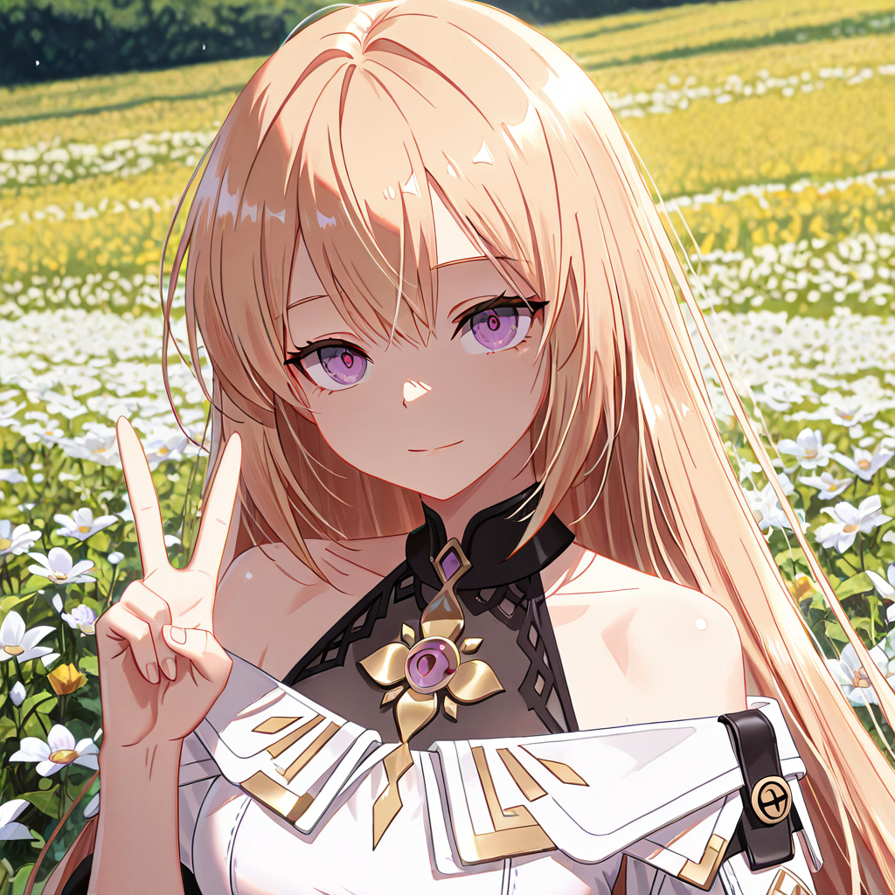
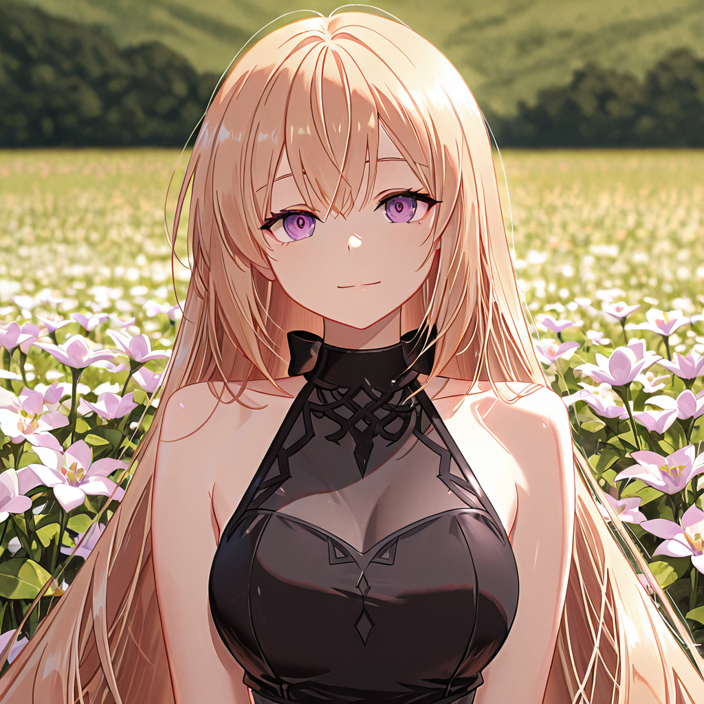
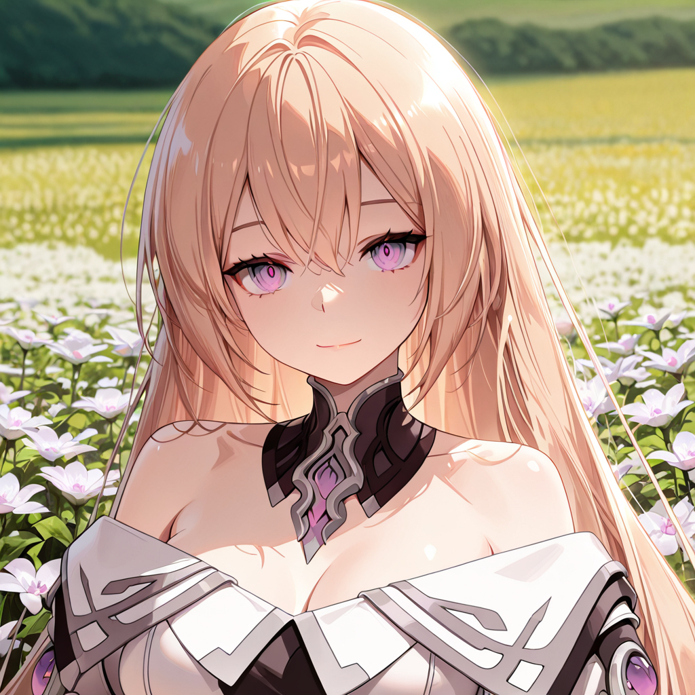

# LoRA-Training LoRA 模型訓練實作
---
本專案旨在展示訓練一款能高度還原訓練角色之外表特色及其特定服飾的 LoRA 模型之變化過程。期盼透過精準的資料集處理與參數調校，在維持角色面部特徵與服裝一致性的同時，具備良好的動作與背景泛化能力。  
---
訓練角色：Eva  

角色來源：電腦遊戲 Eternal Return 永恆輪迴  

訓練基底模型：Illustrious XL 0.1 (https://civitai.com/models/795765/illustrious-xl)

訓練工具：本作品使用 Hollow Strawberry 開發的 kohya-colab (https://github.com/hollowstrawberry/kohya-colab) ，並依本專案需求進行資料集準備與訓練參數設定。感謝原作者提供此工具。

繪圖工具：GIMP (3.2.4)

執行工具：本地端 Stable Diffusion WebUI（Automatic1111）

本地端設備：Intel(R) Core(TM) 7 240H (2.50 GHz) / NVIDIA GeForce RTX 5060 Laptop GPU (8 GB) / 16 GB RAM / 1 TB SSD

---

目的：額外對素材進行手動修復，以期望提升素材之品質與細節；額外取得細節素材，透過降低素材標籤之數量來減少過多標籤產生的互相擠壓的狀況；透過加強學習率來提升學習的效果。

訓練日期：2026 年 09 月 06 日

資料數量：117 

素材大小：1024*1024  

UNet 學習率：2e-4  

Text Encoder 學習率：2e-5  

結果：  
<table>
  <tr>
    <td align="center">
       
      <b>Eva 的 Cadet 造型</b>
    </td>
    <td align="center">
       
      <b> Cadet 造型中的白色披肩移除</b>
    </td>
    <td align="center">
       
      <b>Eva 的 Default 造型</b>
    </td>
  </tr>
</table>

問題探討：證實簡化標籤並加強訓練仍可以得到服裝一定的準確度，並適當將服裝分離，但是像是 Cadet 造型的複雜細節就會出現較大的錯誤，並且由於這三張圖的 Prompt 和 seed 都是一樣的，但是動作卻不一致，沒有比出 ya ，可以推測是在處理素材標籤時有一些標籤導致手部動作無法順利解耦。

---

目的：在訓練過程中將角色身份與服裝特徵分離，完成單一套衣服的配件控制，讓角色能在同一套服裝間進行配件切換時能維持原有的外觀特徵，並同時保持動作的彈性與額外裝扮的可能性。

訓練日期：2026 年 09 月 02 日

資料數量：107 

素材大小：1024*1024  

UNet 學習率：1e-4  

Text Encoder 學習率：4e-5  

結果：  
<table>
  <tr>
    <td align="center">
       
      <b>Eva 的 Cadet 造型</b>
    </td>
    <td align="center">
       
      <b>將cadet造型中的白色披肩移除，確定衣服間的解耦足夠有效</b>
    </td>
  </tr>
</table>

問題探討：Cadet 造型的風格與線條依舊過於強烈，顯示在素材處理與平衡上仍需調整。

---

目的：為增加模型多樣性與泛化性，並緩解過擬合的狀況，透過適當刪減與新增加訓練素材與修改訓練參數來取得更好的LoRA內容，並將經典造型與cadet造型放入同一個LoRA中進行訓練，透過不同的服裝來使LoRA認識辨別不同的衣著狀況，以求達到角色自由換裝的彈性。

訓練日期：2026 年 09 月 01 日

資料數量：100 

素材大小：1024*1024  

UNet 學習率：8e-5  

Text Encoder 學習率：4e-5  

結果：  
<table>
  <tr>
    <td align="center">
       
      <b>Eva 的 Default 造型，露出ya的手勢來確保手動作的可變性</b>
    </td>
    <td align="center">
       
      <b>Eva 的 Cadet 造型，露出ya的手勢來確保手動作的可變性</b>
    </td>
  </tr>
</table>

問題探討：由於 Cadet 造型的資料集過多，導致訓練成果可見較為傾斜向 Cadet 造型，其線條邊緣以及風格較為強烈

---

目的：透過較強的學習率來學習角色與服裝的基本特徵

訓練日期：2026 年 08 月 20 日

資料數量：72  

素材大小：1024*1024  

UNet 學習率：2e-4  

Text Encoder 學習率：2e-5  

結果：  
<table>
  <tr>
    <td align="center">
       
      <b>Eva 的經典造型，保留改變手勢與頭戴花環等彈性</b>
    </td>
    <td align="center">
       
      <b>Eva 的經典造型，能透過提詞改變角色的眼睛狀況</b>
    </td>
  </tr>
</table>

問題探討：邊緣過於粗糙，有些許的過擬合狀況

---
