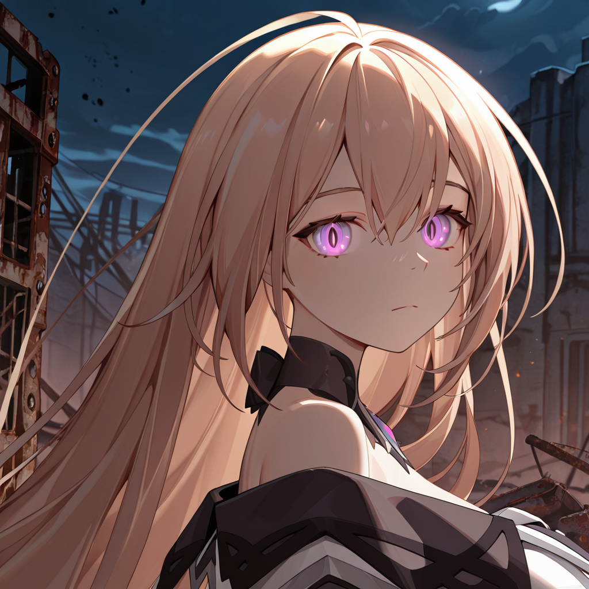
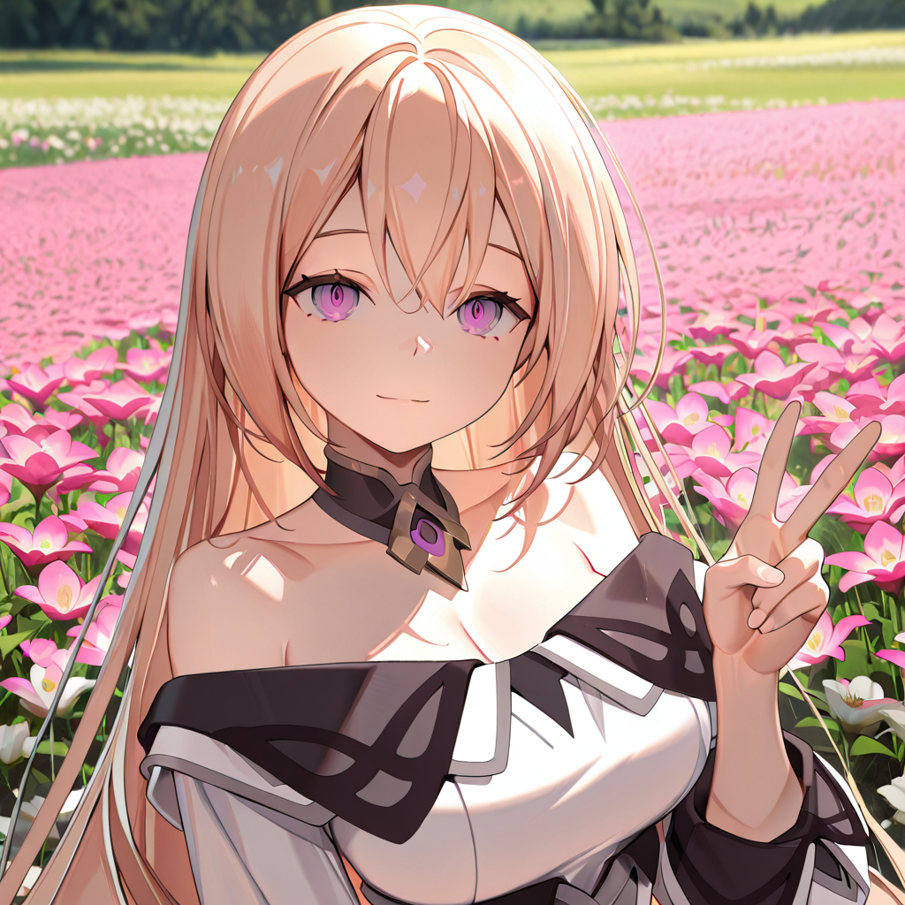
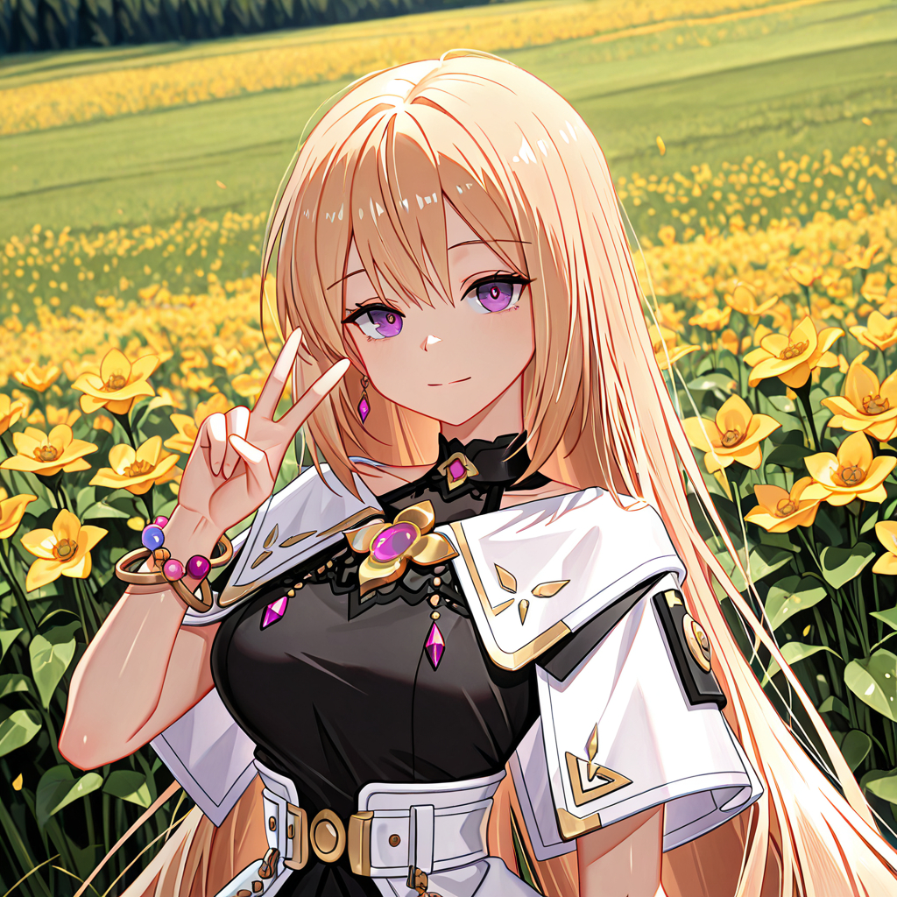
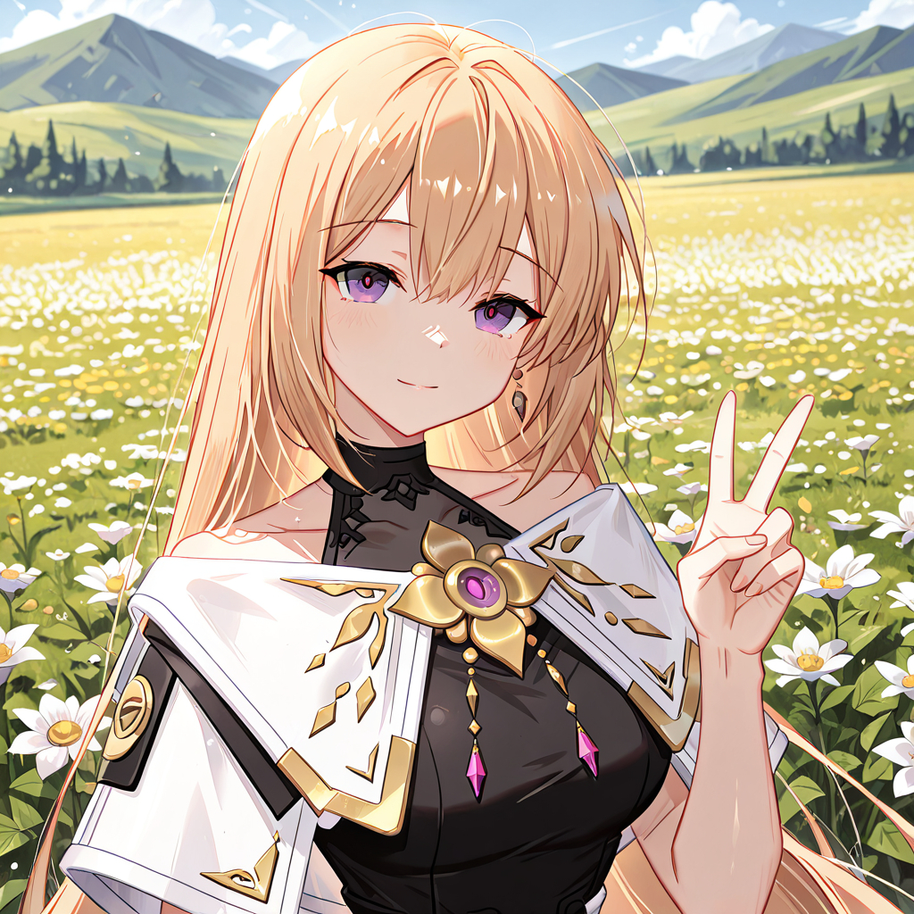
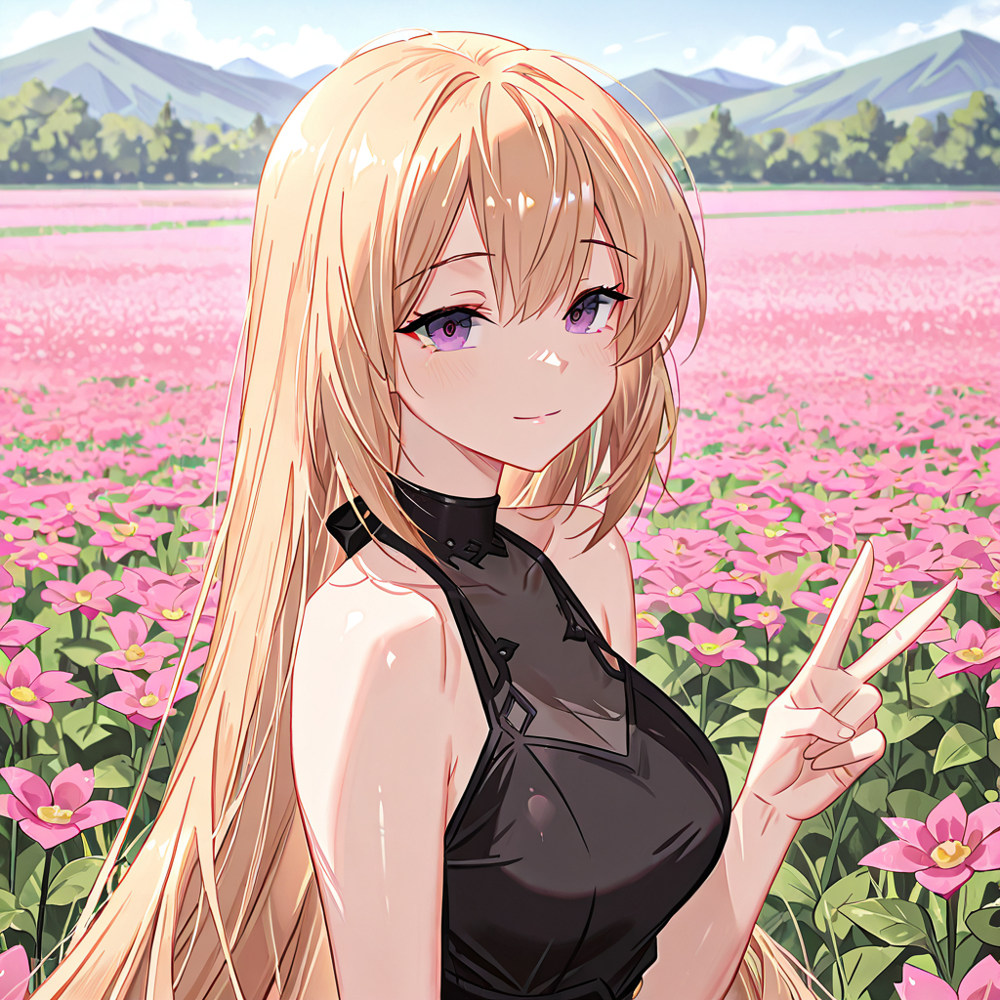

# LoRA-Training LoRA 模型訓練實作
---
本專案旨在訓練一款能高度還原訓練角色之外表特色及其特定服飾的 LoRA 模型。透過精準的資料集處理與參數調校，本模型能在維持角色面部特徵與服裝一致性的同時，具備良好的動作與背景泛化能力。  
---
訓練角色：Eva  

角色來源：電腦遊戲 Eternal Return 永恆輪迴  

訓練基底模型：Illustrious XL 0.1 (https://civitai.com/models/795765/illustrious-xl)

訓練工具：本作品使用 Hollow Strawberry 開發的 kohya-colab (https://github.com/hollowstrawberry/kohya-colab) ，並依本專案需求進行資料集準備與訓練參數設定。感謝原作者提供此工具。

---

資料數量：72  

素材大小：1024*1024  

UNet 學習率：2e-4  

Text Encoder 學習率：2e-5  

結果：  

  
  

---

為增加模型多樣性與泛化性，透過適當刪減與新增加訓練素材與修改訓練參數來取得更好的LoRA內容。

資料數量：100 

素材大小：1024*1024  

UNet 學習率：8e-5  

Text Encoder 學習率：4e-5  

結果：  

  
  

---

透過適當處理訓練素材並改善素材標籤來提升LoRA內容的精準度與彈性。

資料數量：107 

素材大小：1024*1024  

UNet 學習率：1e-4  

Text Encoder 學習率：4e-5  

結果：  

  
  

